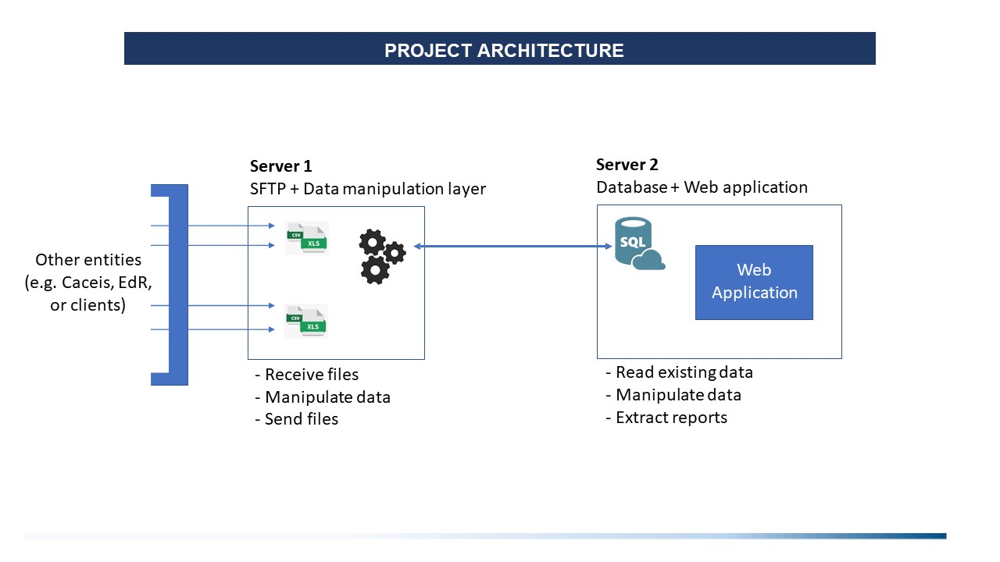
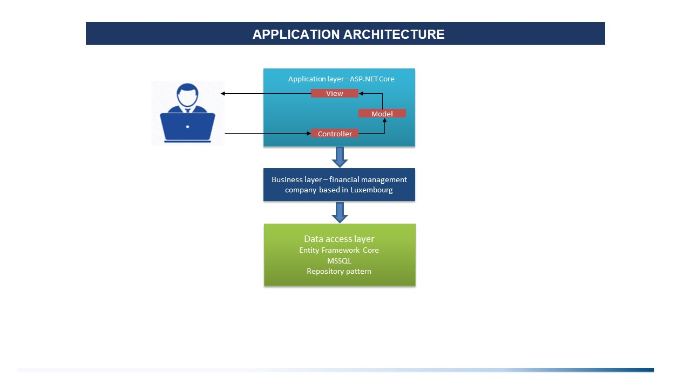
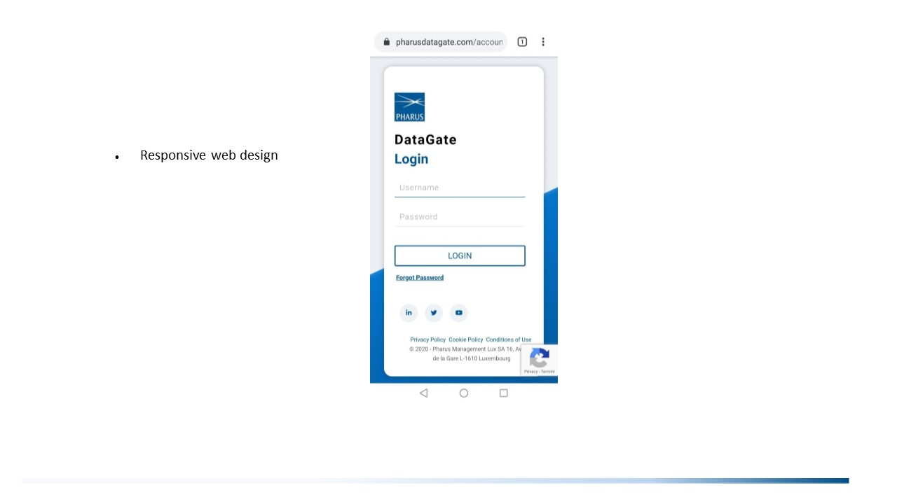

# DataGate Platform
A private web application for managing more than 300 funds. It is developed to be used by Pharus Management Lux S.A 
in order to improve the efficiency and automate some parts of Risk and Legal department.

## Table of contents
* [General Info](#general-info)
* [Guest Account](#guest-account)
* [Technologies](#technologies)
* [Documentation](#documentation)
* [Features](#features)
* [Status](#status)
* [Inspiration](#inspiration)
* [Contact](#contact)

## General Info

The application can display NAV reports on chosen time period and 
detailed information about the UCITS and AIF handled by the management company such as: 
* General related entity view
* Sub entities
* Timeline changes
* Timeseries AuM charts
* Distinct related documents and agreements
* All related documents
* All related agreements
* Fees related to agreements

Other features: 
 * Create and edit fund
 * Excel and PDF extraction
 * Upload documents and agreements
 
 ## Guest Account
https://pharusdatagate.com/  
Username: datagate_guest  
Password: datagate_guest  
 
 ### :hammer: Technologies
* Backend - C# .NET Core 3.1, MVC, REST
* Frontend - RAZOR, CSS, JavaScript ES6, jQuery
* Frameworks - ASP.NET Core 3.1, Bootstrap
* Database - MSSQL Server, Entity Framework Core 3.1
* Testing - xUnit, MyTested.AspNetCore.Mvc
* Project Management - Jira, Trello
* Version Control - Git, TortoiseGit, GitHub
* DevOps - Azure Pipelines
* Hosting and File Storage - GoDaddy WebWiz
* UI/UX design - Photoshop, HTML/CSS, Bootstrap 

## :page_facing_up: Documentation
You can read the documentation [here]().
You can watch videos about the platform:
* [Presentation of DataGate]()
* [DataGate guide]()
* [Legal users guide]()
* [Adminstrators guide]()
* [Create/edit a fund]()
* [Upload a document or agreement]()
* [Add agreement fees ]()

## Functionality
### Guest Users
 - Login, Register
 - View all courses and lessons in this course
 - View home page with all active and previous contests
 
### Logged in Users
 - Submit solution and receive instant responese about how many points he has received
 - Submit solutions only in practice mode
 - Activate student profile using special activation key
 - View information about error, which occurs during excecution only of trial tests
 - View input and output data only of trial tests
 - Cannot view information about error, which occurs during excecution of official test
 - View execution result of tests
 - View their practice results
 - Download resources
 
 ## Users in role "Student"
  - All the functionalities of logged in user
  - Take part of competitions(Send solutions in compete mode)
  - Take part in exam and receive grade
  - Informtion about all passed exams is available in their profile
  - Participate in all contests available in the home page
  - View their compete and practice results
 
### Administrators(Teachers in school)
 - Add student profile to the system
 - Create, edit and delete course (Each course combines some lectures)
 - Create, edit and delete lectures
 - Have access to all contests' results
 - Filter contests' results by username, student class, contest start and end time etc.
 - Create contest for specific lecture with start and end time
 - Edit and delete contests
 - Create, delete and edit problem for specific lecture
 - Add, edit and delete resources for specific lecture
 - Create, edit and delete test for specific problem
 - View input and output data of each tests
 - View information about error, which occurs during excecution of some test

## Breif description of main functionalities
### Student profile
 - When student profile is added to the database, activation key is automatically generated, that is sent to the student's email
 - When the user enter this activation key, he becomes student and role "Student" is added to his roles
 - In this way he obtain full name, student email, number in class, name of class and some other privileges
 
 ### Submissions
  - If there is compile time error, the user can see what is the error
  - If solution is compiled successfully, all tests for this problem are executed over this solution
  - Execution results of tests are: (Success, Run time error, Memory limit, Time limit).
  - User can receive points in range 0 to problem's max points for his solution
  - The system finds user's best solution when process contests' results
  
  ### Lectures
  - Each lecture can be one of the tree types(Homework, Exercise or Exam)
  - Lecture can be added with some password which is really convenient for exam lecture
  
  ## :soon: To be released
