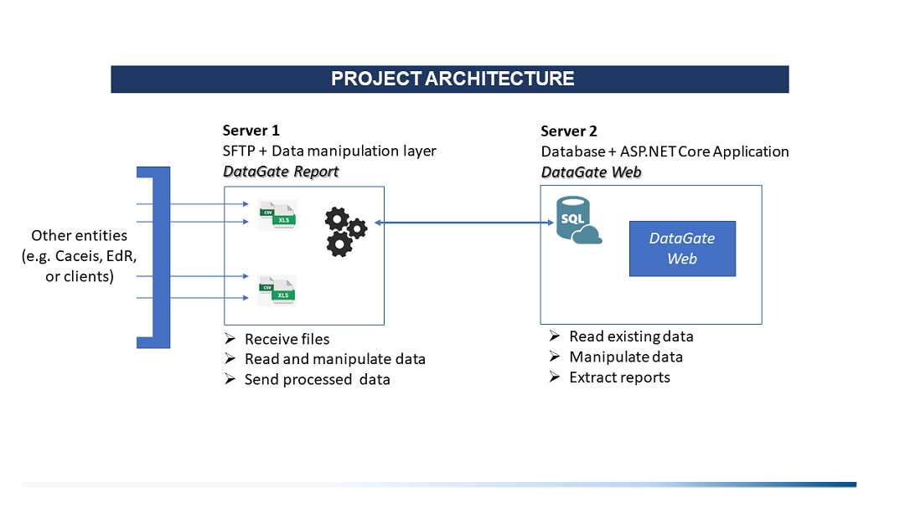
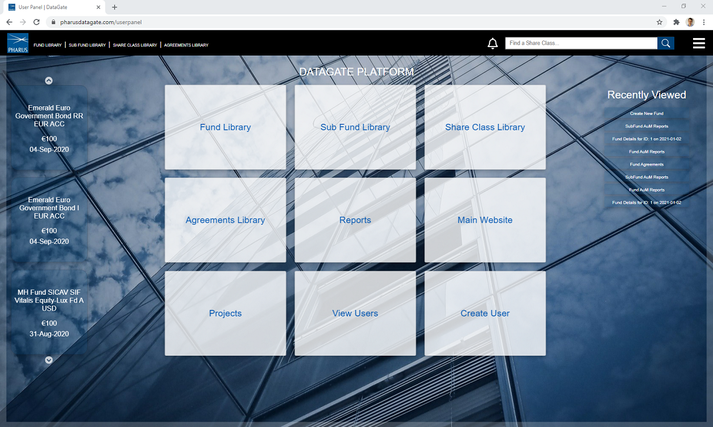
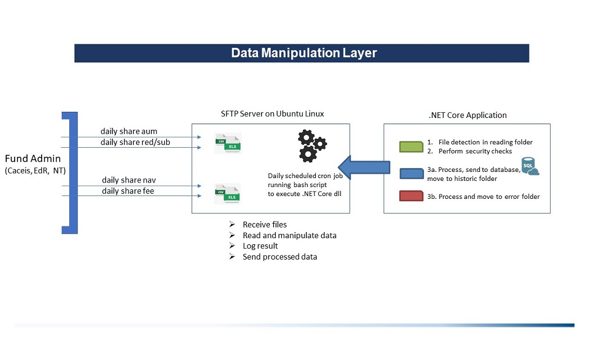
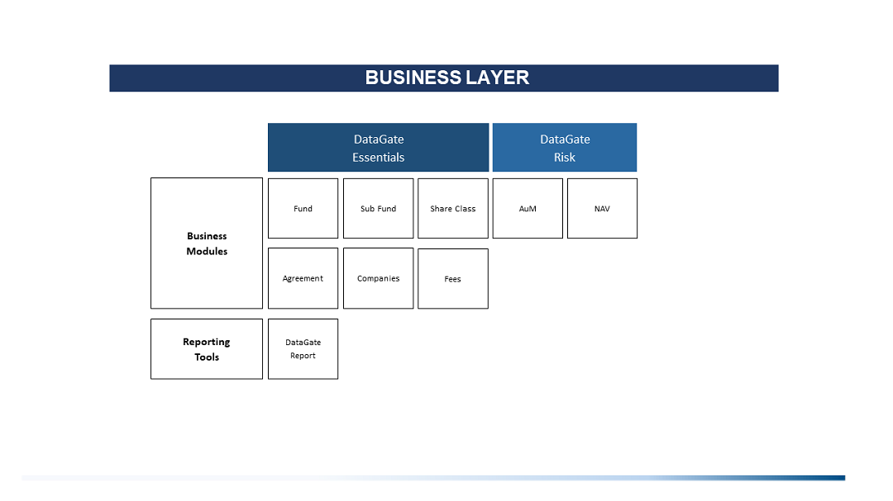
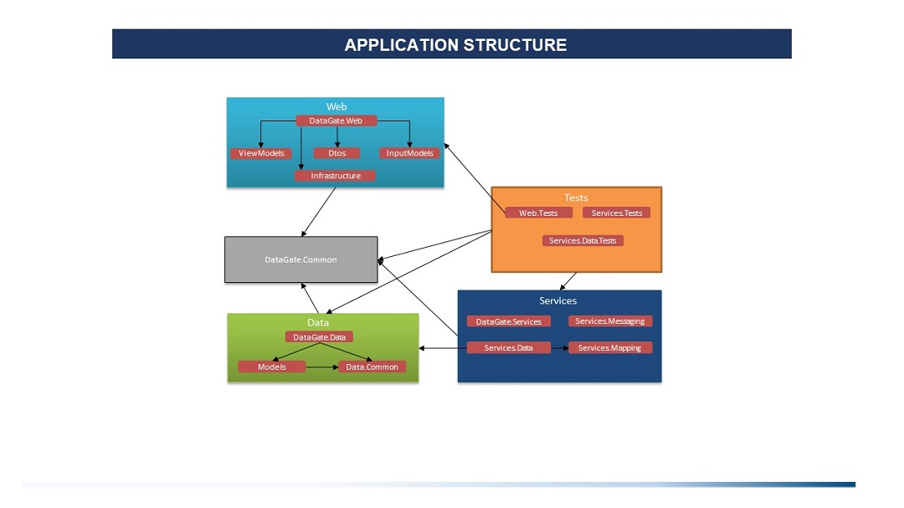

## Project Introduction

**"DataGate"** is a Fund Management Software and consists of two parts:   
   ★ **DataGate Web**   
   ★ **DataGate Report**

## Table of contents
* [DataGate Web](#datagate-web)
  * [General Info](#general-info)
  * [Registration](#registration)
  * [Technologies](#technologies)
  * [Functionality](#functionality)
* [DataGate Report](#datagate-report)
* [Documentation](#documentation)
* [History](#history)
* [License](#license)
* [Contact](#contact)

## DataGate Web 

https://pharusdatagate.com  

An internal web application for managing more than 250 funds.  

★ Increased operational efficiency  
Dealing with separate teams, processes and data sets can be challenging  
and time-consuming [(Gartner)](https://wiki2.org/en/Business_intelligence#cite_note-blumberg-18). Having a single source of data will save users'  
time and increase team operational efficiency.  

★ Automate parts of the Risk and Legal department  

★ Efficient allocation management  
A full data view provides depth and detail - you can move  
from a library view to an individual asset level view. 

  ## Status
   
  
  

## General Info

The application can display NAV reports on chosen time period and  
detailed information about the UCITS and AIF handled by the management company such as: 
* General related entity view
* Sub entities
* Timeline changes
* Timeseries AuM charts
* All related documents
* All related agreements
* Fees related to agreements
 
 ## Registration
Registration is only possible through email invitation and confirmation.  
A guest account has been set-up for free use.  

Username: **datagate.guest**  
Password: **datagate.guest**  
https://pharusdatagate.com  
 
 ## Technologies
* IDE - Visual Studio 2019, VS Code
* Framework - ASP.NET Core 5.0
* Version Control - Git, TortoiseGit, GitHub
* DevOps - Application Insights, Azure Pipelines
* Hosting and File Storage - GoDaddy WebWiz, Web Deploy
* Project Management - Jira, Trello - [link](https://trello.com/pharusit)
* Code review, StyleCop

### Database 
* Two Databases - Identity Users and App
* MS SQL Server, mylittleadmin
* Diagrams -
[Funds](https://github.com/PhilShishov/DataGate/blob/master/Documentation/Views/DB-Diagrams/Funds.png),
[Sub Funds](https://github.com/PhilShishov/DataGate/blob/master/Documentation/Views/DB-Diagrams/SubFunds.png),
[Share Classes](https://github.com/PhilShishov/DataGate/blob/master/Documentation/Views/DB-Diagrams/ShareClasses.png),
[Fund Sub Fund Connection](https://github.com/PhilShishov/DataGate/blob/master/Documentation/Views/DB-Diagrams/FundSubFundConnection.png),
[Sub Fund Share Class Connection](https://github.com/PhilShishov/DataGate/blob/master/Documentation/Views/DB-Diagrams/SubFundShareClassConnection.png),
[Agreements](https://github.com/PhilShishov/DataGate/blob/master/Documentation/Views/DB-Diagrams/Agreements.png),
[Documents](https://github.com/PhilShishov/DataGate/blob/master/Documentation/Views/DB-Diagrams/Documents.png),
[Time Series](https://github.com/PhilShishov/DataGate/blob/master/Documentation/Views/DB-Diagrams/TimeSeries.png)
* Entity Framework Core 3.1, Scaffold, LINQ
* Distributed Cache - Redis 3.0.5, StackExchange

### Backend
* C# .NET 5.0
* 5 Areas, 17 Controllers, 29 Services
* Design Pattern - DAO, DI, TAP, MVC, REST, Repository, SOLID
* Also build with:
  * SendGrid
  * AutoMapper 
  * IStringLocalizer/IHtmlLocalizer
  * EPPlus
  * itext7
  * Full-text search
  * SignalR Core

### Client-side
* RAZOR, JavaScript
* Libraries - jQuery, Ajax, Bootstrap, DataTable, Chart, Chosen, Moment, Slick, SweetAlert, Browser-Update, Cookie
* Libman, Bundle, WebCompiler
* SASS/CSS3, HTML5 (SVG, Canvas, localStorage)

### Testing
* xUnit
* [MyTested.AspNetCore.Mvc](https://github.com/ivaylokenov/MyTested.AspNetCore.Mvc)
* Moq, In-memory Database

### Security
 * ASP.NET Core
 * X-CSRF
 * Cross-site Scripting (XSS)
 * Antiforgery
 * Overposting
 * HTML Sanitization
 * SQL Injection
 * SSL
 * ReCaptcha
 * Browser Update
 
 ### GDPR

## Functionality 
### Logged in Users
 - [Manage Account](https://github.com/PhilShishov/DataGate/blob/master/Documentation/Views/App/ManageAccount.png)
 - Consult libraries - Fund, Sub Fund, Share Class, Agreements
 - Consult particular view - [Sub entities and their connections](https://github.com/PhilShishov/DataGate/blob/master/Documentation/Views/App/DetailFundView.png), 
 [Time Series SF](https://github.com/PhilShishov/DataGate/blob/master/Documentation/Views/App/TimeSeriesSF.png), 
 [Time Series SC](https://github.com/PhilShishov/DataGate/blob/master/Documentation/Views/App/TimeSeriesSC.png), 
 [Documents](https://github.com/PhilShishov/DataGate/blob/master/Documentation/Views/App/Documents.png), 
 [Agreements](https://github.com/PhilShishov/DataGate/blob/master/Documentation/Views/App/Agreements.png), 
 [Timeline](https://github.com/PhilShishov/DataGate/blob/master/Documentation/Views/App/Timeline.png), 
 Fees
 - Manage tool menu - Save Layout, Toogle inactive entities, Update views by date
 - Extract view tables as [PDF](https://github.com/PhilShishov/DataGate/blob/master/Documentation/Views/Extraction/Funds.pdf) 
 and [Excel](https://github.com/PhilShishov/DataGate/blob/master/Documentation/Views/Extraction/Funds.xlsx)
 - Consult AuM NAV [Fund](https://github.com/PhilShishov/DataGate/blob/master/Documentation/Views/App/FundReports.png) / [Sub Fund](https://github.com/PhilShishov/DataGate/blob/master/Documentation/Views/App/SubFundReports.png) and Time Series reports
 - Choose and sort header columns for large table views
 - Perform a global [share class search](https://github.com/PhilShishov/DataGate/blob/master/Documentation/Views/App/SearchView.png)
 - Slide through recent share classes and visit recently viewed links
 - Real-time notifications 
   - Create, edit, delete entity
   - Upload/delete document
 - Multi language support - 
 [English](https://github.com/PhilShishov/DataGate/blob/master/Documentation/Views/App/UserPanel.png) and 
 [Italian](https://github.com/PhilShishov/DataGate/blob/master/Documentation/Views/App/Italian.png)
 - [Error view](https://github.com/PhilShishov/DataGate/blob/master/Documentation/Views/App/Error.png)
 ### Users in role "Legal"
  - All the functionalities of logged in user
  - Upload
   [document](https://github.com/PhilShishov/DataGate/blob/master/Documentation/Views/App/UploadDocument.png),
   [agreement](https://github.com/PhilShishov/DataGate/blob/master/Documentation/Views/App/UploadAgreement.png) and
   fees
 -  Delete document, agreement
  - [Create Entity](https://github.com/PhilShishov/DataGate/blob/master/Documentation/Views/App/Create.png)
  / [Official Update](https://github.com/PhilShishov/DataGate/blob/master/Documentation/Views/App/OfficialUpdate.png)
 ### Administrators
 - All the functionalities of legal user
 - Create, edit and delete user
 - Have access to view users panel
 
 ## DataGate Report
 
  [DataGate Report](https://github.com/PhilShishov/DataGate-Report) - .NET Core application running on SFTP Server.   

The main function is automatic feeding of data into an internal database by the Fund Admin (Asset under management, Subscription, Redeption, Net asset value, Fee)

## Documentation

[Code Metrics Processor](https://github.com/PhilShishov/DataGate/blob/master/Documentation/DataGate_CodeMetricsAnalyzis_20200720.xlsx)

[Responsive Web Design](https://github.com/PhilShishov/DataGate/tree/master/Documentation/Views/App/Responsive)

[All Views](https://github.com/PhilShishov/DataGate/tree/master/Documentation/Views/App)

  
  ## History
**2021-01-02** Published DataGate version 20.2.2 with ASP.NET 5.0.1

**2020-10-30** Updated to ASP.NET Core 3.1.9
  
**2020-10-12** SFTP Data Manipulation Layer - [DataGate Report](https://github.com/PhilShishov/DataGate-Report)

**2020-09-02** Updated to ASP.NET Core 3.1.7

**2020-07-14** Updated to ASP.NET Core 3.1.6

**2020-06-22** Published DataGate version 20.2.1

**2020-02-28** Published DataGate version 20.1.1 with ASP.NET Core 2.1

## License
This project is licensed under the [MIT License](LICENSE)
  
## Contact
:boy: **Philip Shishov**

- LinkedIn: [@philshishov](https://www.linkedin.com/in/philshishov/)
- Github: [@philshishov](https://github.com/philshishov)

### :handshake: Contributing

Contributions, issues and feature requests are welcome!

### :man_astronaut: Show your support

Give a :star: if you like this project!

